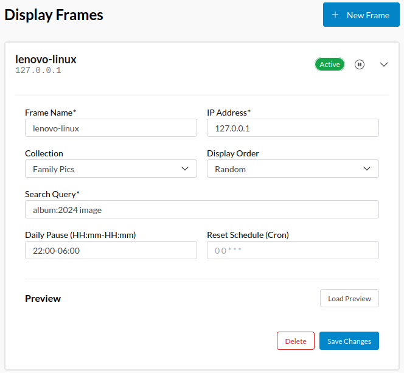

# Rewind-Replay: Relive your (captured) moments!

Rewind-Replay is (planned to be) a no frills, self-hosted photos app that helps in organizing and more importantly searching your photos.


Currently this project is very much a work-in-progress.

# Philosophy

1. We don't want to use cloud providers for personal photo collection.
2. Some of us really care about our media in folders that we have meticulously curated from a long time. With any tool, we want the ability to continue to manage pics in folders.
3. The single source of truth is the photo itself (*). Hence, we want all metadata, including user tags, ML based face / objects labels etc., to go back to the photo, to the extent possible.
4. In the same vein, we also want the tool to utlize the metadata already existing in the photos (updated by device / other tools).
5. In other words, we don't want to be locked-down by any one particular tool (including this one!).
6. Some kind of sensible, not too constrained search is needed, even though it may (will) not be as good as Google.

(*) For those who are not aware, a photo/video taken by a modern camera/phone not only stores the image/video content, but also metadata about the photo/video. For e.g. GPS coordinates, dimensions, orientation, duration for videos etc. There are also provisions to update metadata when they are discovered. For e.g. recognized faces, address based on reverse geo-coding etc.

# Key Terms
1. **Item**: The individual media item (photo / video / audio)
2. **Album**: A group of related media items. For e.g. "2021-10-01 Trip to SVBF"
3. **Collection**: A set of related albums. For e.g. "My family pics", "My small-business pics" etc.
4. **Indexing**: The process of reading media and cataloging metadata to help with search. Also thumbnail generation.

# Current Features

## Media Management
- Support for existing folders and files: Read existing folder structure (specificed during collection creation) and index the files found (if any) under respective collections
- Support for new files: 
    * Immediate indexing - Watch one or more 'listen' folders for new files, and as new files become available, bring them into the respective collection and index them
    * Delayed indexing - Schedule a daily 'cron' to watch the setup 'intake' folders, to bring in files to the collection that are 'x' days stale
- Rename albums (similar to renaming folders on a File Explorer program)
- Select files and move them to a different album
- Select files and trash them
- Backup helper: A helper utility that *incrementally* backs-up all the files into the 'registered' backup drives. See [Backup helper](#backup-helper) section for more information

## Metadata management
- Index media photos, videos and audio
  - Extract key exif data (metadata), and store in SQLite db
  - Thumbnail generation
  - Compress video files into smaller webm files
  - Indexer has the ability to run and gather metadata for multiple files at the same time. See `updateIndexerConcurrency` below
- Mark as favorite / stars (there is no favorite in exif, but there is a 'rating' field)
- Optimize write of metadata to files by delaying the write. This enables grouping all the changes together and writing to file at one go

## Enrichments
- Lookup GPS location
    * First using geolocation api (that comes with exiftool)
    * For US based addresses, use [findNearestAdderss](https://www.geonames.org/maps/us-reverse-geocoder.html#findNearestAddress) API (need a registered username)

## UI features
- Display photos and videos on a responsive, progressive, scrollable grid
- Cluster photos on a map
- Slideshow
- Search photos based on their metadata, using SQLite FTS5
    1. Github *like* search features (key value pairs)
       e.g. `album:trip camera:samsung type:video`
    2. When multiple conditions are prsent, by default they are "AND"ed.
        e.g. `album:trip camera:samsung type:video`
        will translate as
        `{album}: "trip"* AND {camera}: "samsung"* AND {type}: "video"*`
    3. This can be overwritten using the "logical" or "l" input. E.g. `l:or`
    4. The input from "logical" keyword applies to all conditions
        e.g. `album:trip camera:samsung type:video l:or`
        will translate as
        `{album}: "trip"* OR {camera}: "samsung"* OR {type}: "video"*`
    5. Any un-prefixed condition will be applied to/restricted to all [search-enabled columns](https://github.com/mrbrahman/rewind-replay/blob/develop/app/database/search-db.mjs#L3)
    6. For advanced needs (including querying non restricted columns - for e.g. `file_date`), use the "raw"
       input using SQLite FTS syntax. Thich will be used as-is in the filter.
        e.g. 
          - `raw:"metadata match '{album}: (states* AND trip*)'"`
          - `raw:"strftime('%W',file_date)=strftime('%W',date()) and strftime('%Y',file_date) != strftime('%Y',date())"` (all 'past' photos of current week)
    7. "raw" can be clubbled with other filters, if needed

## Flagship feature - Digital Photo Frames!

We take thousands of photos and videos — and rarely see them again.

Traditional digital frames help, but they’re limited by SD cards and manual updates. Content becomes static and quickly outdated.

This system turns any web browser into a centrally managed digital photo frame.

* No SD cards.
* No file copying.
* No device lock-in.

If a device can open a browser — TV, tablet, old laptop, Android TV box — it can become a live photo frame.

All that you do is register the "frame"



Specify the 
* IP address
* A search crieteria (refer to 'search photos' in [UI features](#ui-features))
* A reset schedule (crontab format) - to auto-refresh the playlist for the frame
* Dailay Pause range - to auto pause the frame during that time period

The frame is setup, and available at `http://<server-ip>/frame.html`

Traditional frames are static and manual. This is dynamic, automated, and server-controlled.

Your memories don’t sit in storage — they stay alive.

A true "rewind-replay" feature!

## Backup helper

This module helps take backup of the collections to external drives.

When the folders are renamed, backup utilities like `rsync` see them as file-deletions and file-additions. That's a waste of resources especially on large video files. A simple thing could be to just perform `mv` operation on the target backups as well.

That's exactly what this setup aims to help with.

- Register backup device(s) (with UUID of the device)
- All file opertions on a collection are noted in a table
- When it is time to backup to a specific device, all 'delta' operations are determined and applied to the set of files eligible for backup.
- The 'last_backup_id' is noted for each backup.

TODO - sync timestamps on +2 level folders

# Features TODO
**Near future**
- Add/change "tags" (keywords)
- Display more info (filename, description, camera, date/time, people, location) on the file being viewed
- Ability to rename files

**After near future**
- Face recognition
- An acutal form to setup collections
- Form to update config and save it to persistant storage (file?)
- Monitor indexer progress
- Enable multiple collections
- Ability to upload photos from device
- Intelligent scrollbar (folder levels?)
- Object detection (computer vision)
- Authentication and Authorization
- Sharing photos/albums

# How to install & use

- **Install necessary software**
  - [Node](https://nodejs.org/en/) (to run the server)
  - [ffmpeg](https://ffmpeg.org/download.html) (for video operations: thumbnail extraction, compression)
  - On Linux, simply run 
    ```bash
    sudo apt install node ffmpeg
    ```

- **Install code (just clone this repo)**
  ```bash
  git clone https://github.com/mrbrahman/rewind-replay.git
  ```
  Or, grab the latest release from the [Releases](https://github.com/mrbrahman/rewind-replay/releases) page

- **Install node dependencies**
  ```bash
  cd rewind-replay/server
  npm install
  ```

- **Special instructions for HEIC support (TBD for Linux)**

  For heic support, need to do some extra stuff at the moment. See https://github.com/lovell/sharp/issues/4164 for more details
  
  ```bash
  # https://sharp.pixelplumbing.com/api-output#heif
  brew install vips libheif libde265 x265

  # https://sharp.pixelplumbing.com/install#building-from-source
  npm install --build-from-source node-addon-api node-gyp sharp
  ```

- **Start server**
  ```bash
  cd rewind-replay/server
  node server.mjs
  ```

- **Setup Collection & Start Indexing**

  Until the UI is available to create collections and auto-start indexing, use REST API.

  Example for creating collection with real-time watcher
  ```bash
  cat > c.json <<EOF
  {
    "collection_name":"Test",
    "collection_path":"/home/mrbrahman/Projects/test-collection/",
    "album_type":"FOLDER_ALBUM",
    "intake_configs":[
      {
        "path":"/home/mrbrahman/Projects/test-collection-new-files/",
        "method":"immediate",
        "config":{
          "awaitWriteFinish":true,
          "ignoreInitial":true
        }
      }
    ],
    "apply_folder_pattern":"yyyy/yyyy-mm-dd",
    "default_collection":1
  }
  EOF
  ```

  Example for creating collection with scheduled cron indexing
  ```bash
  cat > c.json <<EOF
  {
    "collection_name":"Test",
    "collection_path":"/home/mrbrahman/Projects/test-collection/",
    "album_type":"FOLDER_ALBUM",
    "intake_configs":[
      {
        "path":"/home/mrbrahman/Projects/bulk-import/",
        "method":"scheduled",
        "config":{
          "schedule":"0 2 * * *",
          "staleDays":2
        }
      }
    ],
    "apply_folder_pattern":"yyyy/yyyy-mm-dd",
    "default_collection":1
  }
  EOF
  ```

  Example for creating collection with mixed watcher and cron paths
  ```bash
  cat > c.json <<EOF
  {
    "collection_name":"Test",
    "collection_path":"/home/mrbrahman/Projects/test-collection/",
    "album_type":"FOLDER_ALBUM",
    "intake_configs":[
      {
        "path":"/home/mrbrahman/Projects/camera-import/",
        "method":"immediate",
        "config":{
          "awaitWriteFinish":true
        }
      },
      {
        "path":"/network/shared-photos/",
        "method":"scheduled",
        "config":{
          "schedule":"0 1 * * *",
          "staleDays":1
        }
      }
    ],
    "apply_folder_pattern":"yyyy/yyyy-mm-dd",
    "default_collection":1
  }
  EOF
  ```

  ```bash
  curl -X POST -H 'Content-Type: application/json' -d @c.json "http://localhost:9000/api/createNewCollection"
  
  # Verify
  curl -X GET 'http://localhost:9000/api/getAllCollections' | jq '.'
  ```

  Start indexing (this will kick off indexer process in the background and return immediately)
  ```bash
  curl -X POST 'http://localhost:9000/api/startIndexingFirstTime?collection_id=1'
  ```
  
  Monitor progress
  ```bash
  curl -X GET 'http://localhost:9000/api/getIndexerStatus' | jq '.'
  ```

  ```bash
  # If you notice your system resources are not fully utilized, you can increase indexer concurrency
  # Suggest to increase by 1 at a time, until you see resources getting fully utilized
  $ curl -X PUT 'http://localhost:9000/api/updateIndexerConcurrency/2'

  ```
- Visit your rewind-replay page http://localhost:9000
- As indexing progresses, you should see photos appear
- Enjoy!

# Architecture
## Main
- nodejs server
- SQLite 3 database

## Supporting
- Sqlite3 provided FTS5 for searches
- sharp for image operations
- exiftool-vendored for metadata read / write
- Use browser native features (HTML5) to play videos

# Notes

## Start nodejs server using systemd

* Place .service file in `~/.config/systemd/user/rewind-replay.service`
* Use the following commands to start/restart/stop etc
  ```bash
  alias start='systemctl --user start rewind-replay.service'
  alias stop='systemctl --user stop rewind-replay.service'
  alias rs='systemctl --user restart rewind-replay.service'
  ```
* Use the follwing for checking logs in `journalctl`
  ```bash
  # logs from the start of the service
  alias log='journalctl --user -u rewind-replay.service --all --no-hostname'
  # similar to `tail -50f`
  alias logs='journalctl --user -f -u rewind-replay.service --all --no-hostname --lines 50'
  # just logs from today
  alias lt='journalctl --user -u rewind-replay.service --all --no-hostname --since today'
  ```
