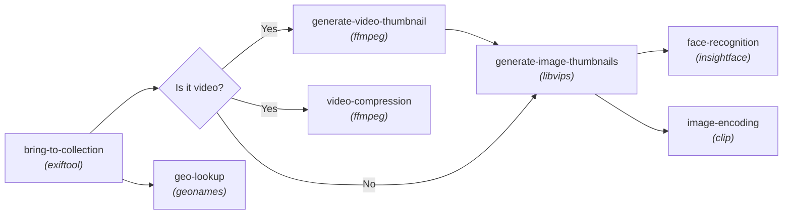
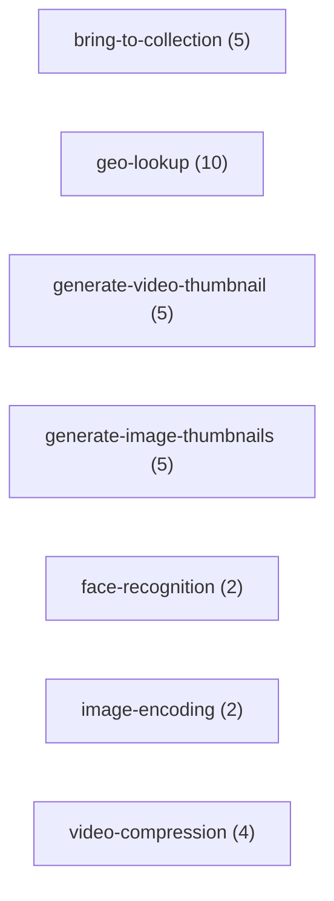
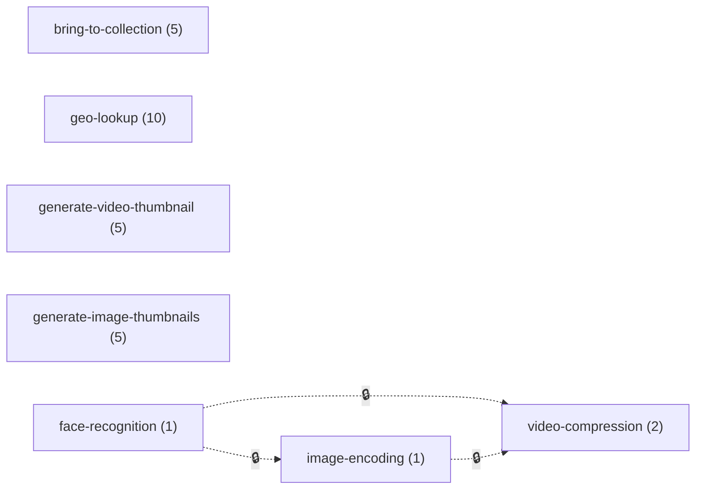
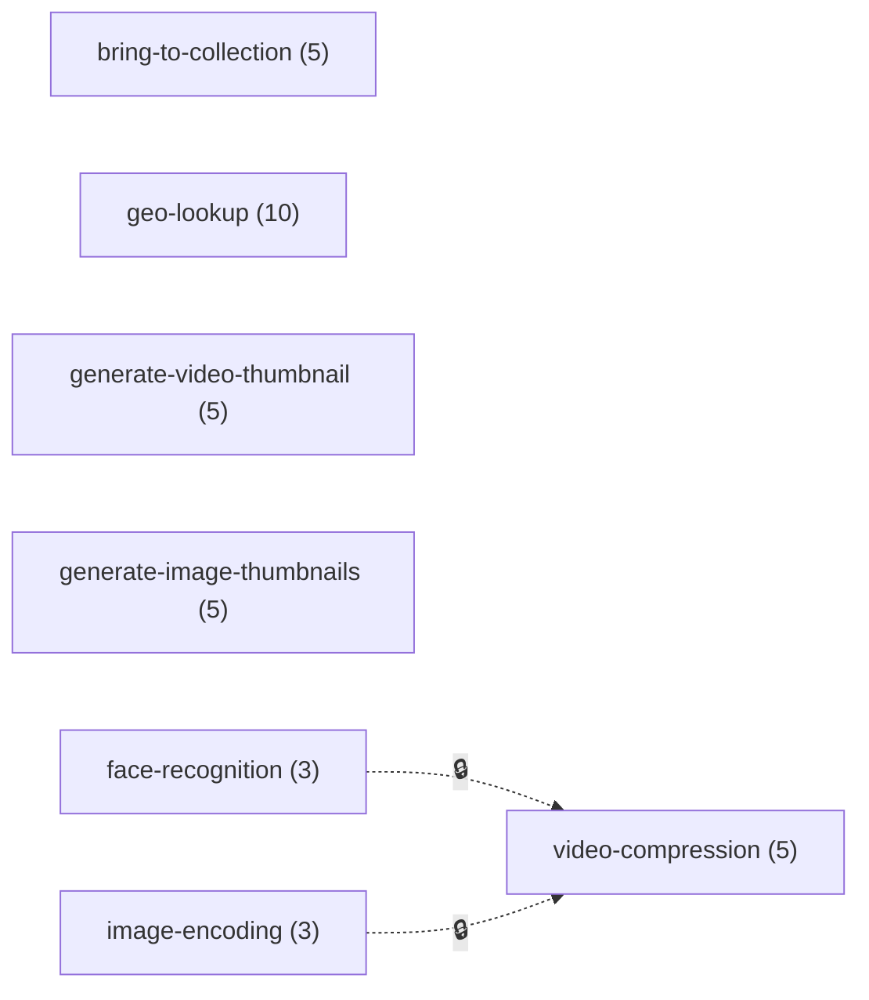

# Pipeline Design - Future Enhancement

## Current State

The indexing pipeline uses a single queue with priority levels (matching Node.js behavior):
- `indexQueue` (CPU-1 workers) - High: indexFile, Normal: face recognition, Low: video compression
- `geoQueue` (1 worker) - rate-limited geo API lookups (separate due to rate limiting)
- `videoQueue` exists but is currently unused (video compression was moved to indexQueue Low priority so it doesn't run concurrently with indexing)

The `internal/queue/Queue` struct supports:
- Three priority levels (High > Normal > Low, FIFO within each)
- Independent concurrency (configurable per queue)
- Pause/resume per queue
- Status/errors per queue
- Any `func() error` as a task

## Goal

Allow users to define a configurable processing pipeline. There are two
orthogonal concerns, and keeping them separate is the whole point of this design:

1. **Data flow** - how an item moves from stage to stage. This is *fixed* and
   hardcoded in Go. It defines what the pipeline *is*.
2. **Resource scheduling** - which stages are allowed to run at the same time as
   which, so contended resources (CPU, GPU, rate-limited APIs) are not
   oversubscribed. This is the *tunable* part the user configures.

The rest of this document covers the two in that order: the fixed data flow
first, then the configurable scheduling on top of it.

## Static data flow (fixed, hardcoded)

Every item enters at `bring-to-collection` and then flows through a fixed
dependency graph. This routing lives in Go code; no config or diagram changes it.



Routing rules (fixed, in code):
- An item always enters at `bring-to-collection`.
- After `bring-to-collection`, the item fans out to `geo-lookup` and to a
  media-type branch:
  - **Video items:** `generate-video-thumbnail` and `video-compression` both run
    (the two ffmpeg stages are independent of each other).
    `generate-video-thumbnail` then feeds `generate-image-thumbnails` - the
    extracted video frame is treated like an image from that point on.
  - **Image items:** go directly to `generate-image-thumbnails`.
- `generate-image-thumbnails` (libvips) is the predecessor for both ML stages,
  `face-recognition` (insightface) and `image-encoding` (clip). Since the ML
  enhancement, both consume the compressed image produced by
  `generate-image-thumbnails` rather than the original file.

Each edge is a single-predecessor edge: a stage enqueues its successor(s) when it
finishes. No stage waits on *multiple* predecessors for the same item, so there is
no fan-in join to track.

## Dynamic resource scheduling (configurable)

The data flow above says nothing about *concurrency*. Running everything as fast
as possible would oversubscribe contended resources. But which stages contend
depends entirely on the machine, so this layer is tunable per install:

- On a box with a GPU, `face-recognition` and `image-encoding` (both GPU-bound)
  can run in parallel with the CPU-bound stages like `video-compression` - two
  different resources, no contention.
- On a CPU-only box, those same three stages all fight for the CPU, so the user
  may want to serialize some of them (e.g. do not run `video-compression` while
  the ML stages are running).
- On a box with lots of CPU, the user may instead raise per-stage concurrency
  (e.g. compress 5 videos at once) and gate very little.

Crucially, **resource gating is independent of data flow.** A gate can sit
between two stages that have no data-flow relationship at all (e.g.
`video-compression` gated behind `face-recognition` purely because they share a
CPU on a GPU-less box, even though the data flow lets them run in parallel). So
gating is captured as its own graph, not derived from the data-flow graph or from
any left-to-right ordering.

The mechanism is a one-directional **gate** between stages. Each gate is an
explicit edge "B is gated behind A": B must not start a task while A is busy.
Stages with no gate between them may run concurrently. This is orthogonal to each
stage's own *internal* concurrency (how many items it processes in parallel).

### Terminology

- **Stage** - a unit of work with its own queue and concurrency (e.g.
  `generate-image-thumbnails` with max concurrency 5). Stages are fixed.
- **Busy** - a stage is *busy* when it has any task running OR any task pending
  (running + pending > 0). A stage is *fully drained* when it is not busy:
  nothing running and nothing queued.
- **Gate** - a one-directional exclusion relationship. If B is gated behind A,
  then B must not start a task while A is busy. B yields to A; A never waits for B.
- **Concurrency** - a stage's own max parallelism (how many items it runs at
  once). Independent of gating.
- **Coexisting stages** - any two stages with no gate edge between them may run
  concurrently, each up to its own concurrency limit.

### Gating semantics (the core of this change)

A gate is about avoiding *concurrent execution*, not about data dependency and
not about pending work.

Precise rule:
- **A gated stage B must not start a task while its upstream A is *busy*, where
  busy means A has any task running OR any task pending (running + pending > 0).**
  In other words, B waits until A is *fully drained* - nothing running and nothing
  queued.
- A pending B task is allowed to sit in B's queue. It simply is not *dispatched*
  (started) while A is busy.
- The gate is evaluated at **dispatch time** - the instant B is about to start a
  task, it checks whether any upstream is busy. A pending B task becomes eligible
  only once the upstream is fully drained, so the check cannot be done only at
  enqueue time.

Why "fully drained" and not merely "no running task": using running+pending avoids
a blip where A momentarily has zero running tasks (between two of its own items)
but still has queued work. Under a "no running task" rule, B could opportunistically
grab a slot in that gap and then overlap with A when A picks up its next pending
item. Requiring A to be fully drained removes that race: B only starts once A is
genuinely done.

Tradeoff (accepted): this is stricter / more throughput-conservative. Under a
continuous trickle of input (e.g. a live folder watch that keeps feeding an
upstream), the upstream may rarely reach empty, so a gated stage could be delayed
for a long time. For this app's common case - batch indexing a folder, draining it,
then compressing - "fully drained" is exactly the desired behavior and the trickle
concern does not apply. If steady-trickle starvation ever becomes a problem, revisit
per-gate configurability.

Directionality and tie-breaks (a gate is one-directional; the upstream has priority):
- **The upstream A never waits for the gated stage B.** B yields to A.
- If A becomes busy again while B already has tasks running, those in-flight B
  tasks are **not** killed - they finish naturally. But no *new* B task is
  dispatched until A is fully drained again.
- So the invariant is "do not *start* B while A is busy." With the fully-drained
  rule this overlap is rare (B only started because A was empty, and A becoming
  busy again requires new input), but if it does occur, B's already-running work
  finishes rather than being killed. This is an accepted tradeoff.

### Example configurations

The same fixed data flow can be scheduled many ways depending on the hardware available.
The diagrams below show only the **gate graph** - each dotted edge with a lock
label reads "A blocks B" (B does not start while A is busy). The dotted line and
lock label are deliberately different from the solid data-flow arrows `-->` in the
[Static data flow] section, so the two graphs are not confused; a gate edge may
connect stages that have no data-flow relationship. The number in parentheses is
each stage's own max concurrency (internal parallelism), independent of gating.
Stages with no gate
edge between them run concurrently.

For the first cut, the user supplies this configuration as JSON text (see [Config
format] below); a graphical builder may come later. Either way, the model is the
same gate graph.

**GPU box** - the two ML stages run on the GPU, everything else on CPU. The two
resources do not contend, so there are no gates at all: every stage runs as soon
as its data-flow predecessor is done, bounded only by its own concurrency. (No
gate edges.)



**CPU-only box** - no GPU, so the ML stages and video compression all compete for
the CPU. The user serializes the CPU-heavy work so only one heavy model runs at a
time and compression waits for both: `face-recognition` blocks `image-encoding`,
and both ML stages block `video-compression`. The compression gate runs *tangent*
to data flow - there is no data-flow edge between `video-compression` and the ML
stages, yet on this box they contend for the CPU. Lighter stages
(`bring-to-collection`, `geo-lookup`, thumbnails) are left ungated.



**Big-CPU box** - lots of CPU, no GPU. Instead of gating, the user raises
concurrency so many items run at once (e.g. 5 concurrent video compressions). The
two ML stages are left to run concurrently (no gate between them), but
`video-compression` is still gated behind both - it is the heaviest CPU consumer,
so it waits until the ML work is fully drained.



## Tentative design in Go

### 1. Each stage = a `queue.Queue` instance (already available)

Each stage gets its own queue with its own concurrency. The gate needs the
upstream's *busy* state (running + pending). The queue already exposes both via
`GetStatus()` (`Active` = running, `Pending` = queued), so no new counters are
required - the gate reads `Active + Pending > 0`.

### 2. Stage definition

```go
type Stage struct {
    Name        string
    Concurrency int
    Fn          func(item *PipelineItem) error // the actual work
    Queue       *queue.Queue

    // Data flow (hardcoded routing): where an item goes after this stage.
    Downstreams []*Stage

    // Resource gating: this stage must not START a task while any of these
    // upstream stages is busy (running or pending). Evaluated at dispatch time.
    GatedBy []*Stage
}
```

Note the two lists are separate on purpose: `Downstreams` is data flow,
`GatedBy` is resource scheduling. They are configured from different sources
(Downstreams from code; GatedBy derived from the user's scheduling config).

### 3. Gate evaluation

A stage is *busy* if its queue reports any running OR pending task. The gate for a
stage is "no upstream in `GatedBy` is busy" (all upstreams fully drained).

```go
func (s *Stage) upstreamBusy() bool {
    for _, up := range s.GatedBy {
        st := up.Queue.GetStatus()
        if st.Active > 0 || st.Pending > 0 {
            return true
        }
    }
    return false
}
```

Because the gate must be checked at dispatch time, the queue's dispatch loop needs
a way to defer starting a task when the gate is closed. Chosen approach:

- **Option A - gate hook in the queue (chosen).** Add an optional
  `CanDispatch func() bool` to `queue.Queue`. Before the dispatch loop starts a
  task, it calls the hook; if it returns false, it does not dispatch and waits for
  the next notify to re-check. The gate hook is
  `func() bool { return !stage.upstreamBusy() }`. This keeps gating logic out of
  the pipeline's item-forwarding path, and the queue never calls Pause/Resume for
  gating (those stay reserved for explicit admin control - see Control
  Responsibility below).

- **Option B - orchestrator-driven pause/resume (rejected).** The orchestrator
  watches upstream busy counts and calls `stage.Queue.Pause()` / `Resume()` as
  gates open and close. Rejected: it overloads the pause flag with two meanings
  (gating vs admin) and needs a polling watcher goroutine that is racier around
  the drained transition.

Option A makes the gate decision exactly at dispatch, closing the race where B
starts in the same instant A becomes busy. It requires a small, well-contained
change to the queue (a pre-dispatch predicate + an on-drained signal).

Re-checking (efficient trigger): the gate `!upstreamBusy()` can only flip from
closed to open when an upstream becomes **fully drained** - its running + pending
count reaches **zero**. Therefore the kick must fire on the upstream's
**busy -> drained transition**, NOT on every task completion.

- Kicking on every completion is wasteful: if an upstream has 5 tasks running (or
  more pending) and one finishes, the gate is still closed. The gated stage would
  wake, re-evaluate `CanDispatch()`, get false, and sleep again - a wasted wakeup.
- The only meaningful edge is the queue going empty: the last task completes AND no
  pending tasks remain. At that instant the orchestrator signals the notify
  channels of the stages that list this upstream in `GatedBy`.

Concretely: when a worker finishes a task and decrements the queue's active count,
the queue checks whether running + pending is now zero; if so it fires an "idle"
(drained) signal, which the orchestrator forwards to the dependent gated stages.

Because gating waits for full drain (running + pending == 0), the momentary-idle
blip does not arise: a gated stage only starts once its upstreams are genuinely
empty, and the one-directional rule handles the rare case where new input arrives
at an upstream just after it drained.

#### Control Responsibility

- **The queue** decides moment-to-moment whether it may dispatch, by evaluating its
  `CanDispatch()` predicate at dispatch time. Gating never sets the queue's paused
  flag; a gated-closed queue is simply declining to dispatch, not paused.
- **The orchestrator** wires each gated stage's predicate
  (`CanDispatch = !upstreamBusy`) and delivers the drained-signal kicks to gated
  stages when an upstream empties. It does not read or flip pause state for gating.
- **`Pause()` / `Resume()`** remain reserved for explicit operator/admin control
  (the admin endpoints, manual stop). A stage can be gated-closed AND admin-paused
  independently; both must be clear before it dispatches (`!isPaused && CanDispatch()`).

### 4. Pipeline orchestrator

```go
type Pipeline struct {
    stages map[string]*Stage
    entry  *Stage // bring-to-collection
}

// Submit puts a new item at the entry stage. Routing to downstreams is
// hardcoded; gating is enforced by the queue's dispatch predicate.
func (p *Pipeline) Submit(item *PipelineItem) {
    p.enqueue(p.entry, item)
}

func (p *Pipeline) enqueue(stage *Stage, item *PipelineItem) {
    stage.Queue.Enqueue(queue.Task{
        Description: stage.Name,
        Fn: func() error {
            if err := stage.Fn(item); err != nil {
                return err
            }
            // Data flow: forward to hardcoded downstreams.
            for _, ds := range stage.Downstreams {
                p.enqueue(ds, item)
            }
            return nil
        },
    })
}
```

Note there is no `JoinTracker` here. An earlier design modeled the gate as a
per-item data dependency (video-compression waits for both thumbnail AND geo *for
the same item*) and needed a fan-in join. Under this model the gate is a *resource*
constraint, not a per-item join, so no join tracking is needed. The data-flow graph
does have intermediate dependencies (e.g. `face-recognition` and `image-encoding`
run only after `generate-image-thumbnails`, and `generate-video-thumbnail` feeds
`generate-image-thumbnails`), but each is a single-predecessor edge expressed
directly in the hardcoded routing (`Downstreams`) - a stage simply enqueues its
successor when it finishes. No stage waits on *multiple* predecessors for the same
item, so no fan-in join tracker is required. If a genuine per-item fan-in
dependency is ever added, it would be handled separately in the hardcoded routing.

### 5. Config format

Only the tunable parts (per-stage concurrency and gating) come from config. Data
flow is not configurable.

The config is JSON: a flat list of stages, each with its own `concurrency` and an
optional inline `gatedBy` list naming the stages it is gated behind. Because gating
is an independent graph (not tied to data flow or any ordering), `gatedBy` can name
*any* stage. Absence of a `gatedBy` entry means no gate - the stage may run
concurrently with everything it is not gated behind.

Concretely (the "CPU-only box" example above - `video-compression` gated behind
both ML stages, and `image-encoding` gated behind `face-recognition`):

```json
{
  "stages": [
    { "name": "bring-to-collection", "concurrency": 5 },
    { "name": "geo-lookup", "concurrency": 10 },
    { "name": "generate-video-thumbnail", "concurrency": 5 },
    { "name": "generate-image-thumbnails", "concurrency": 5 },
    { "name": "face-recognition", "concurrency": 1 },
    { "name": "image-encoding", "concurrency": 1, "gatedBy": ["face-recognition"] },
    { "name": "video-compression", "concurrency": 2, "gatedBy": ["face-recognition", "image-encoding"] }
  ]
}
```

Each entry in `gatedBy` becomes a `GatedBy` edge on that stage (read "this stage is
gated behind the named stage"). Validation: every stage in the fixed data flow must
appear exactly once; every name in a `gatedBy` list must be a known stage; and the
gate graph must be acyclic (a cycle would deadlock, since each stage would wait for
the other to drain).

### 6. Runtime control APIs

```
GET  /api/admin/pipeline/status          -> status per stage (pending, running, gated?)
PUT  /api/admin/pipeline/stages/:name/concurrency/:n
PUT  /api/admin/pipeline/stages/:name/pause
PUT  /api/admin/pipeline/stages/:name/resume
```

Status should expose, per stage: pending, running, and whether it is currently
*gated closed* (an upstream is still busy - running or pending).

### 7. Conditional stages

Some stages only apply to certain media types:
- generate-video-thumbnail, video-compression: only for video items
- generate-image-thumbnails: for images directly, and for videos after
  generate-video-thumbnail produces a frame
- face-recognition, image-encoding: only for items that have a generated image
  (i.e. downstream of generate-image-thumbnails)
- geo-lookup: only if GPS coordinates exist

The stage function handles this (returns nil immediately if not applicable), or we
add a `Condition func(*PipelineItem) bool` field to Stage. This is orthogonal to
gating.

## Migration Path

1. Phase 3 (done): Two hardcoded queues, pipeline logic in `indexing/pipeline.go`
2. Future step: Refactor pipeline.go to use Stage structs with hardcoded
   `Downstreams` routing (data flow), keeping current behavior.
3. Future step: Add the dispatch-time gate predicate (`CanDispatch`) and the
   on-drained signal to `queue.Queue` (Option A), then wire `GatedBy` +
   drained-transition re-check in the orchestrator.
4. Future step: Add config parsing for concurrency + gating only.
5. Future step: Add per-stage status/control endpoints (including gated state).

## Confirmed Decisions

- **Gate condition (confirmed):** a gate holds the downstream until its upstream is
  *fully drained* (running + pending == 0), not merely momentarily idle. This
  avoids the blip where the upstream has zero running but still-queued work.
  Accepted tradeoff: stricter/more conservative; a continuous trickle into an
  upstream could delay its downstream. Fine for the batch-index workload; revisit
  per-gate config if trickle starvation ever appears.
- **Tie-break (confirmed):** a gate is one-directional. The upstream never waits
  for the gated stage; the gated stage yields to the upstream. When an upstream
  becomes busy again while its gated stage has tasks running, those in-flight tasks
  finish naturally (they are never killed), but no new task is dispatched until the
  upstream is fully drained. Brief overlap of in-flight downstream work with the
  upstream's newly-arrived work is accepted.
- **Gate scope (confirmed):** gating holds only the directly gated stage(s) and
  everything downstream of them - not the whole pipeline.
- **Drained re-check (confirmed, required):** the kick fires on an upstream's
  **busy -> drained transition** (running + pending reaches zero), NOT on every
  task completion. Kicking per-completion is wasteful because the gate stays closed
  while any upstream task is running or pending. When an upstream becomes fully
  drained, it signals the notify channel of each stage that lists it in `GatedBy`.
  A gated stage must not stall waiting for an unrelated notify, so this
  drained-transition kick is a hard requirement, not an optimization.

## Files to Create (when implementing)

```
go-server/internal/pipeline/
    stage.go       # Stage struct (Downstreams + GatedBy)
    pipeline.go    # Pipeline orchestrator, Submit, enqueue, gate re-check
    config.go      # Parse JSON stages (concurrency + inline gatedBy), validate DAG (not data flow)
    handler.go     # Per-stage status/control endpoints
```

Queue changes (small, contained) to `internal/queue/queue.go` for Option A gating:
1. An optional pre-dispatch predicate `CanDispatch func() bool`, checked in the
   dispatch loop alongside the existing `isPaused` check (dispatch requires
   `!isPaused && (CanDispatch == nil || CanDispatch())`).
2. An on-drained signal: when a worker's `active.Add(-1)` brings running to zero
   and no pending tasks remain, fire a callback/channel so the orchestrator can
   kick the stages gated behind this queue. The queue already tracks `active` and
   pending counts, so this is a cheap check at task completion.
