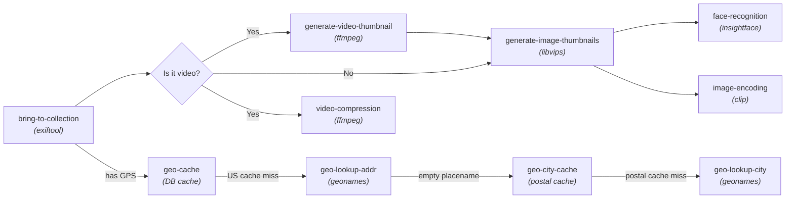
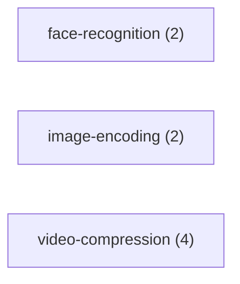
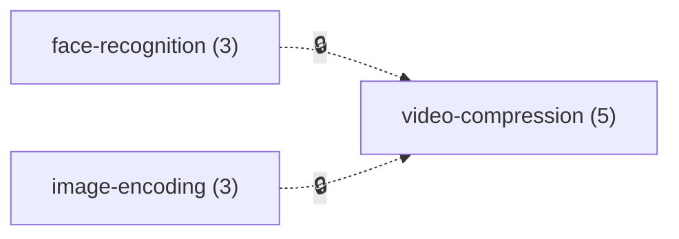

# Indexing Pipeline Architecture

This describes the indexing pipeline as built: a set of work **queues**, a
fixed **data-flow routing** between them, and pluggable **gaters** that decide
when each queue may dispatch. It is a how-it-works document; it links to the
code rather than restating it.

Related docs: the broader module map is in
[architecture.md](architecture.md).

## Three layers

The design deliberately separates three concerns, each owned by a different
layer so no layer knows how the others decide:

1. **Queue** (`internal/queue/queue.go`) - a priority work queue with its own
   concurrency, pause/resume, an event stream, and a set of opaque *gates*. It
   runs `func() error` tasks and knows nothing about stages, data flow, or what
   any gate means.
2. **Gaters** - strategies that decide *when* a queue may dispatch. Each owns
   its own condition and its own notion of "something changed," and exposes a
   uniform contract (`pipeline.Gater`). Two exist: the **resource gater**
   (`internal/pipeline/gater.go`) and the **geo rate gater**
   (`internal/pipeline/georate.go`).
3. **Pipeline** (`internal/pipeline/pipeline.go`) - owns all the queues (one per
   stage), the fixed data-flow routing between them, and the set of gaters. It
   wires each gater onto the queues it governs. It has no `Stage` type and does
   not know how any gate is computed.

Two orthogonal concerns run through these layers:

- **Data flow** - how an item moves from stage to stage. Fixed, hardcoded in Go
  (`routeDownstreams` in `internal/pipeline/enqueue.go`). It defines what the
  pipeline *is*.
- **Resource scheduling** - which stages may run at the same time, so contended
  resources (CPU, GPU, a rate-limited API) are not oversubscribed. Tunable per
  install via config, enforced by gaters.

## Stages (the queue master list)

Each stage is one entry in the pipeline's queue master list: a named
`queue.Queue` plus a work function and a system-level enable flag. The internal
record is `node` (`internal/pipeline/stage.go`); it carries no routing or gating
state - routing is a pipeline concern and gating belongs to the gaters.

The fixed stages (names in `internal/pipeline/pipeline.go`):

| Stage | Work | Notes |
|-------|------|-------|
| `bring-to-collection` | exiftool extract + place + DB insert | entry; structural |
| `geo-cache` | GPS/country derive, non-US resolve, US DB exact/proximity cache | local, no API |
| `geo-lookup-addr` | geonames `findNearestAddress` | API, rate-gated |
| `geo-city-cache` | postal-code DB cache lookup | local, no API |
| `geo-lookup-city` | geonames `postalCodeLookup` | API, rate-gated |
| `generate-video-thumbnail` | ffmpeg first-frame extract | video only; structural |
| `generate-image-thumbnails` | libvips thumbnails + ML buffer | structural |
| `face-recognition` | insightface | ML; needs the image buffer |
| `image-encoding` | CLIP embedding | ML; needs the image buffer |
| `video-compression` | ffmpeg webm | video only |

The stage work functions live in `internal/pipeline/stages_impl.go`; each has
the shape `func(uuid string, hint *StageHint) error` and is standalone-callable
(given a bare uuid it self-hydrates from the DB/disk), so a single stage can be
re-run outside the orchestrated flow via `EnqueueStage`.

## Data flow (fixed, hardcoded)

Every item enters at `bring-to-collection` and flows through a fixed graph. A
stage enqueues its successor(s) when it finishes; each edge is single-
predecessor (no stage waits on multiple predecessors for the same item, so there
is no fan-in join to track). Routing is implemented in `routeDownstreams`
(`internal/pipeline/enqueue.go`), which filters the candidate successors per
item.


```mermaid
flowchart LR
    A["bring-to-collection<br><i>(exiftool)</i>"] --> B{Is it video?}
    A -- "has GPS" --> H["geo-cache<br><i>(DB cache)</i>"]

    H -- "US cache miss" --> H2["geo-lookup-addr<br><i>(geonames)</i>"]
    H2 -- "empty placename" --> H3["geo-city-cache<br><i>(postal cache)</i>"]
    H3 -- "postal cache miss" --> H4["geo-lookup-city<br><i>(geonames)</i>"]

    B -- Yes --> C["generate-video-thumbnail<br><i>(ffmpeg)</i>"]
    C --> D
    B -- Yes --> G["video-compression<br><i>(ffmpeg)</i>"]
    B -- No --> D["generate-image-thumbnails<br><i>(libvips)</i>"]

    D --> E["face-recognition<br><i>(insightface)</i>"]
    D --> F["image-encoding<br><i>(clip)</i>"]
```

Routing is **output-driven**: a stage sets fields on the item/hint and the
router reads them, exactly as the media-type branch reads `Mediatype`/`hasGPS`.
The signals live on `PipelineItem` / `StageHint` (`internal/pipeline/item.go`);
the hint carries a stage's outputs forward, and `absorb` pulls them back onto
the item so the router (and downstream stages) see them.

Routing rules:

- An item always enters at `bring-to-collection`.
- It then fans out to `geo-cache` (if it has GPS) and to a media-type branch:
  - **Video:** `generate-video-thumbnail` and `video-compression` both run (the
    two ffmpeg stages are independent). `generate-video-thumbnail` then feeds
    `generate-image-thumbnails` - the extracted frame is an image from there on.
  - **Image:** goes directly to `generate-image-thumbnails`.
- **Geo is a four-step chain, each step routed on the previous step's output:**
  - `geo-cache` (local) resolves from GPS/country and the US DB cache; it is
    terminal unless it is a US cache miss, which routes to `geo-lookup-addr`.
  - `geo-lookup-addr` (API) calls `findNearestAddress`; if the result has an
    empty placename it routes to `geo-city-cache`, otherwise it is terminal.
  - `geo-city-cache` (local) checks the postal-code DB cache; a hit writes the
    final address (terminal), a miss routes to `geo-lookup-city`.
  - `geo-lookup-city` (API) calls `postalCodeLookup` and writes the final
    address (terminal).
  - The two local `*-cache` stages absorb every cache hit, so each rate-gated
    API stage makes **exactly one** geonames call per dispatch - a reserved
    budget unit is never spent on a cache hit. A cache hit / non-US / no-GPS item
    never calls the API. The geo *work* (cache + geonames) is the pure `geo`
    package (`internal/geo/finalizer.go`); the pipeline stages orchestrate it.
- `generate-image-thumbnails` feeds both ML stages, `face-recognition` and
  `image-encoding`, each of which consumes the thumbnail's in-memory buffer.

## Gaters

A **gater** decides, moment to moment, whether a queue may dispatch. It
implements `pipeline.Gater` (`internal/pipeline/gater.go`):

- `GateName()` - the gate's label on the queue (also the UI block reason).
- `Governs()` - which queues it gates.
- `IsOpen(queue)` - the cheap, read-only admission check.
- `Attach(host)` - register its gate on the governed queues and set up its own
  kicking (re-evaluating a queue when its condition may have changed).

The pipeline iterates its gaters and, for each governed queue, registers a gate
with the queue (`wireGates` in `pipeline.go`). The queue stays neutral: it holds
`{name, isOpen, reserve}` gates and, at dispatch, requires every gate open
(short-circuit; the first closed gate is the block reason). Pause and gating are
independent - a queue can be admin-paused and/or gate-blocked, and both must be
clear to dispatch.

Each gater owns its own *kicking* (how it learns its condition changed); this is
deliberately not part of the `Gater` interface because it differs per gater (see
each below).

### Gates are pulled at dispatch, not watched

A subtle but load-bearing property: the queue evaluates a gate's `isOpen` only
when it is attempting to dispatch; it does not watch gate conditions. A gate can
open (an upstream drains, the rate budget resets) without the gated queue
knowing - it only finds out by re-evaluating on its next dispatch attempt, which
is why a gater must `Kick()` the queue when its condition may have changed.

The consequence: gate/block state is only meaningful when a queue has work to
dispatch. An empty queue is just "idle"; whether a gate is notionally closed is
invisible and irrelevant. So `GetStatus().BlockReason` (and the UI) report a
block reason only when something is pending and a dispatch attempt actually hit a
closed gate - an idle stage reads as idle even if a gate would be closed. There
is exactly one gate evaluation per dispatch attempt and one truth (the first
closed gate), and that same result is what the status/SSE report; the pipeline
does not separately recompute "is this stage gated" for the UI.

### Resource gater

`resourceGater` (`internal/pipeline/gater.go`) implements resource scheduling: a
governed queue must not start a task while any of its gating upstreams is
**busy**. It owns the gate graph (`gatedBy`: queue name -> gating upstream names)
and a busy lookup over the pipeline's queues.

- **Busy** = running OR pending (`Active + Pending > 0`). A stage is **fully
  drained** when neither.
- `IsOpen(B)` = no upstream of B is busy. Evaluated at **dispatch time**, so a
  pending B task sits in B's queue and simply is not started while an upstream is
  busy.
- **Kicking:** the gater subscribes to each gating upstream's event stream and,
  on the upstream's busy->drained transition (`Active==0 && Pending==0`), kicks
  the stages gated behind it so they re-evaluate. It kicks only on that edge, not
  on every completion (a mid-drain completion leaves the gate closed, so waking
  the gated stage would be wasted).

#### Why "fully drained" and not "no running task"

Using running+pending avoids a blip where an upstream momentarily has zero
running tasks (between two of its own items) but still has queued work. Under a
"no running task" rule a gated stage could grab a slot in that gap and overlap
with the upstream when it picks up its next item. Requiring full drain removes
that race.

Tradeoff (accepted): this is throughput-conservative. Under a continuous trickle
into an upstream (e.g. a live folder watch) the upstream may rarely reach empty,
delaying its gated downstream. For the common case - batch-index a folder, drain
it, then compress - fully-drained is exactly right. Revisit per-gate config if
trickle starvation ever appears.

#### Directionality (one-directional; upstream has priority)

- The upstream A never waits for the gated stage B; B yields to A.
- If A becomes busy again while B already has tasks running, those in-flight B
  tasks finish naturally (never killed), but no *new* B task starts until A is
  fully drained again. With the fully-drained rule this overlap is rare (B only
  started because A was empty), and the brief overlap is accepted.

### Geo rate gater

`geoRateGater` (`internal/pipeline/georate.go`) implements geonames rate
limiting. It is fully self-contained and symmetric with the resource gater: it
owns its condition (the geonames request budget - hourly/daily counters plus
their persisted state file under `DATA_DIR`), decides *when* to kick (an
hour/day rollover timer), and *what* to kick (the two governed API queues,
`geo-lookup-addr` and `geo-lookup-city`). The `geo` package holds no rate state.

The rate gate is a **consuming** gate - it both admits and consumes:

- `IsOpen` is the pure, read-only budget check (within hourly and daily limits).
  It may be evaluated many times per dispatch attempt (and on attempts that then
  bail), so it must have no side effects.
- `Reserve` is the atomic check-and-increment that actually consumes one unit. It
  is registered as the gate's `reserve` and the **queue calls it once at the
  commit point** - after a concurrency slot is secured and the final pause/stop
  check passes, right before the task launches - so it fires exactly once per
  task that runs, never on a speculative `isOpen` check. See the commit-point
  logic in `drainQueue` (`internal/queue/queue.go`) and `RegisterConsumingGate`.

Because each API stage makes exactly one call per dispatch (the `*-cache` stages
absorb hits) and the consume is atomic, the shared budget across the two API
queues is honored precisely: we only ever reserve >= calls made, so geonames'
hard limit is never exceeded. When over budget the gate is closed and items wait
in place (no mark-and-skip, no partial write); the rollover timer resets the
counters and kicks both queues so held items resume.

Reserve-at-commit can fail in a rare race (the sibling API queue took the last
unit between the gate check and the commit). The queue treats a failed reserve
like a closed gate: release the slot, requeue the task, set the gate as the block
reason, and stop until the next kick. Multiple consuming gates on one queue are
allowed; if an earlier one reserved and a later one denies, the earlier
reservation is **not** refunded (over-reserving is safe for a hard limit, and it
keeps the queue simple).

## Configuration

Only the **tunable** parts are config: per-stage concurrency, a per-stage enable
flag, and the resource-gating graph. Data flow is not configurable. The config
is a JSON blob persisted in `runtime_config` under `pipelineConfig`, parsed and
validated in `internal/pipeline/config.go`.

```json
{
  "stages": [
    { "name": "bring-to-collection", "concurrency": 5 },
    { "name": "geo-cache", "concurrency": 10 },
    { "name": "geo-lookup-addr", "concurrency": 1 },
    { "name": "geo-city-cache", "concurrency": 10 },
    { "name": "geo-lookup-city", "concurrency": 1 },
    { "name": "generate-video-thumbnail", "concurrency": 5 },
    { "name": "generate-image-thumbnails", "concurrency": 5 },
    { "name": "face-recognition", "concurrency": 1 },
    { "name": "image-encoding", "concurrency": 1, "gatedBy": ["face-recognition"] },
    { "name": "video-compression", "concurrency": 2, "gatedBy": ["face-recognition", "image-encoding"] }
  ]
}
```

- `gatedBy` is the resource-gating graph: "this stage is gated behind the named
  stage(s)." Because gating is independent of data flow, `gatedBy` may name any
  stage, including one with no data-flow relationship.
- The geonames **rate** gate is NOT part of this config - it is geo-owned and its
  condition is the geonames budget, not an editable edge. It surfaces only as a
  stage's block reason.
- Validation (`config.go`): every fixed stage appears exactly once; no unknown
  stages; structural stages (entry + thumbnail stages) cannot be disabled; every
  `gatedBy` name is a known stage; and the gate graph is acyclic (a cycle would
  deadlock, each stage waiting for the other to drain).
- Config is applied live without a restart (`Apply` in `pipeline.go`): enable
  flags, concurrency, and the gate graph are updated in place, gaters re-attach,
  and every queue is kicked. Invalid config is rejected atomically (the running
  pipeline is left unchanged). The seed/migration is
  `internal/database/migrations/015-geo-stage-split.sql` (and the base
  `014-pipeline-config.sql`).

### Example gate graphs by hardware

The same fixed data flow is scheduled differently per machine. The diagrams
below show only the **gate graph** - a dotted lock edge "A 🔒 B" reads "B does
not start while A is busy." Numbers in parentheses are each stage's own
concurrency (independent of gating). Omitted stages are ungated. (Geo stages are
left ungated here; only the geonames rate gate constrains the geo API queues,
and that is not part of this graph.)

**GPU box** - the two ML stages run on the GPU, everything else on CPU. No
contention, so no gates: every stage runs as soon as its data-flow predecessor
is done, bounded only by its own concurrency.


```mermaid
flowchart LR
    e["face-recognition (2)"]
    f["image-encoding (2)"]
    g["video-compression (4)"]
```

**CPU-only box** - the ML stages and compression contend for the CPU. Serialize
the heavy work: `face-recognition` blocks `image-encoding`, and both block
`video-compression` (which runs tangent to data flow - no data-flow edge to the
ML stages, but it contends for the same CPU).


```mermaid
flowchart LR
    e["face-recognition (1)"]
    f["image-encoding (1)"]
    g["video-compression (2)"]

    e -.->| 🔒 | f
    e -.->| 🔒 | g
    f -.->| 🔒 | g
```

**Big-CPU box** - raise concurrency instead of gating. The two ML stages run
concurrently; `video-compression` (heaviest) still waits behind both.


```mermaid
flowchart LR
    e["face-recognition (3)"]
    f["image-encoding (3)"]
    g["video-compression (5)"]

    e -.->| 🔒 | g
    f -.->| 🔒 | g
```

## Runtime control and status

Per-stage admin endpoints (`internal/pipeline/handler.go`, mounted under
`/api/admin`):

```
GET  /api/admin/pipeline/status                      per-stage status snapshot
GET  /api/admin/pipeline/events                      live per-stage status (SSE)
GET  /api/admin/pipeline/config                      current config JSON
PUT  /api/admin/pipeline/config                      validate + apply + persist
POST /api/admin/pipeline/config/validate             validate only
PUT  /api/admin/pipeline/stages/:name/concurrency/:n set a stage's concurrency
PUT  /api/admin/pipeline/stages/:name/pause          pause a stage
PUT  /api/admin/pipeline/stages/:name/resume         resume a stage
```

Per-stage status includes pending/active/completed/failed counters, paused, max
concurrency, and the block reason (the first closed gate's name, e.g.
`resource` or `rate`, or empty when dispatching/idle). The block reason is only
meaningful when a stage has pending work, so an idle stage reads as idle even if
a gate would nominally be closed.

### Live status via the queue event stream

The queue is the single **emitter** of live status. Each queue emits an event on
every dispatch-cycle transition (enqueue, start, completion, pause, resume,
concurrency change, gate block/clear) carrying its own facts - the counters,
paused, concurrency, and current block reason - via `Subscribe() <-chan Event`.
Two independent consumers subscribe to that same stream:

- **The pipeline orchestrator** - the resource gater's drained-kick watches each
  gating upstream's events for the busy->drained edge (this is its kicking
  mechanism; see the resource gater above).
- **The SSE broadcaster** (`internal/pipeline/sse.go`) - forwards per-stage
  snapshots to the browser over `GET /api/admin/pipeline/events`. Because the
  queue carries a full snapshot in every event, the broadcaster adds only the
  pipeline-level overlay the queue cannot know (the stage `enabled` flag and
  friendly identity); the block reason comes straight from the queue.

Properties that fall out of this design:

- **Silent when idle.** Events are emitted only on transitions, so an idle
  pipeline produces no traffic - this replaced an unconditional 1.5s poll on the
  Indexer page.
- **No server-side throttling.** The server emits per transition; the browser
  client coalesces DOM updates (buffers and flushes once per
  `requestAnimationFrame`) so bursts under load do not thrash layout.
- **Auth over the cookie path.** An `EventSource` cannot send an Authorization
  header; the admin route authenticates via the `refreshToken` cookie that the
  browser sends automatically on same-origin requests (the same fallback used
  for media), and `AdminMiddleware` reads the role it sets.

For the SSE mechanics and the client wiring, see `internal/pipeline/sse.go` and
the Indexer component (`web/js/components/pl-admin-indexer.js`).

## Code map

| Concern | File |
|---------|------|
| Queue (gates, events, dispatch, reserve-at-commit) | `internal/queue/queue.go` |
| Gater contract + resource gater | `internal/pipeline/gater.go` |
| Geo rate gater (budget, timer, Reserve) | `internal/pipeline/georate.go` |
| Pipeline: nodes, wiring, Apply | `internal/pipeline/pipeline.go` |
| Data-flow routing | `internal/pipeline/enqueue.go` |
| Item / hint (routing signals) | `internal/pipeline/item.go` |
| Stage work functions | `internal/pipeline/stages_impl.go` |
| Config parse/validate | `internal/pipeline/config.go` |
| Admin + SSE handlers | `internal/pipeline/handler.go`, `internal/pipeline/sse.go` |
| Geo work (pure cache + geonames) | `internal/geo/finalizer.go` |
| Config seed/migration | `internal/database/migrations/014-pipeline-config.sql`, `015-geo-stage-split.sql` |
